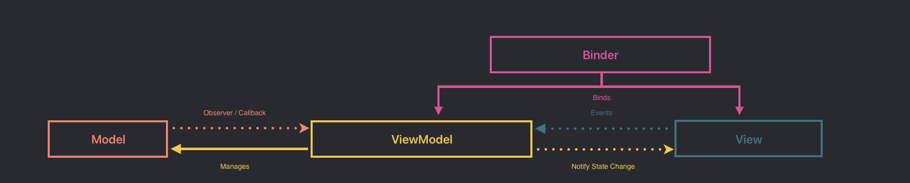

# WishList

## A simple WishList app with SwiftData, using the MVVM architectural Design Pattern

## Platform Compatibility

## Tecnologies

- Database: **SwiftData** for persisting data.

## App Case Study

### Story: Customer want an app to be able to add wish items to a list, like a ToDo, (I want an Apple Vision Pro for my 27th birthday, I wish a new MacBookPro 16" for christmas and so on).

## Feature Specs

WIP

---

## Model Specs

WIP

---

## App Architecture 

## Get in Touch

 
 

